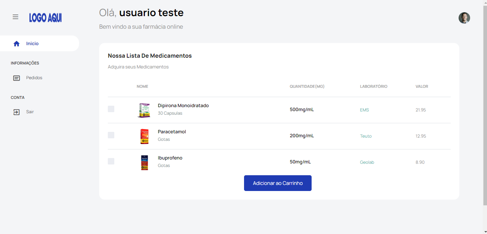

<h1 align="center">Sistema de Farmacia Online</h1>

🚀 Sistema simplificado de compra de medicamentos online.

### Recursos Inplantados até o momento

- [x] Cadastro de usuário
- [x] Listar Produtos
- [x] Carrinho de Compras
- [x] Realizar Pedido
- [x] Lista com Pedidos Realizados
- [ ] Sistema Administrativo
- [ ] Integração com Meios de Pagamentos

<a href="https://farmaciaonline.ddns.net/" target="_blank">🔗 Clique aqui para testar Demo Online</a>

### Pré-requisitos

✔️Servidor com Apache instalado ( Roda em hospedagem Compartilhada normalmente )
 
✔️Versão do PHP 7.3
 
✔️Extensão PDO Instalada
 
✔️Mysql ou MariaDB Instalado

### 🎲 Rodando a aplicação

1 - Faça o Download desse Repositorio ou clone

2 - Suba via FTP para seu servidor de hospedagem

3 - Descompacte o Arquivo

4 - Agora crie um usuario e um banco de dados no mysql ou MariaDB e suba o arquivo painel_farmacia.sql

5 - Abra o arquivo config.php e coloque as informações de host, usuario, nome do banco e senha.

6 - Instalação Completa!

<h1 align="center">Screenshot</h1>
<h1 align="center">
  
</h1>
